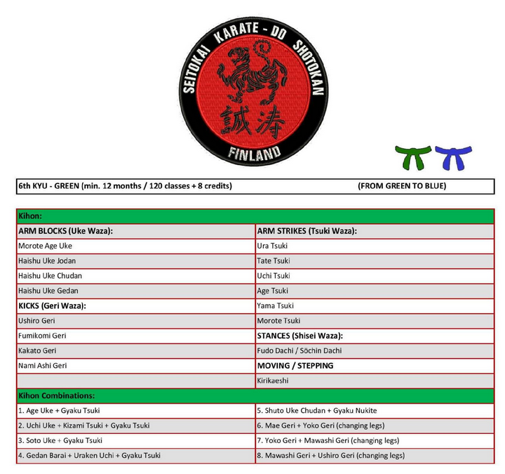
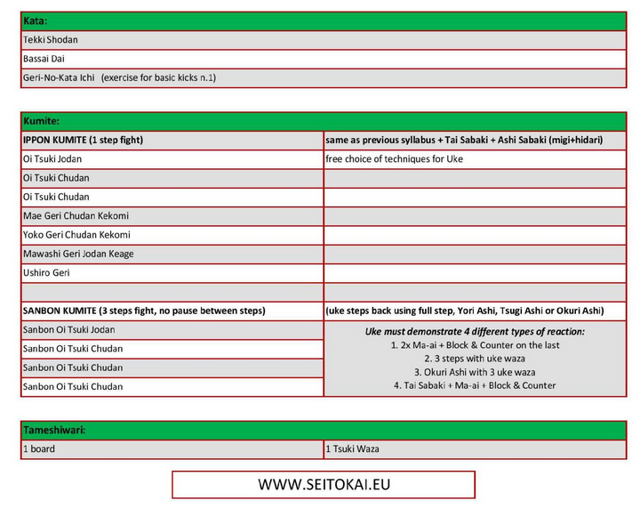

# Shotokan db

Tässä projektissa luodaan tietokanta, joka sisältää kaikki Shotokan-tyylisuunnan karatessa harjoiteltavat asiat:

- seisonnat
- torjunnat
- lyönnit
- iskut
- potkut
- liikkuminen
- yhdistelmätekniikat
- katat
- kumite
- murskaus

Lisäksi luodaan käyttöliittymä, jonka avulla käyttäjä voi hakea tietokannasta:

- tiettyä tekniikkaa suomeksi tai japaniksi
- tietoa, missä katoissa kyseinen tekniikka esiintyy
- tekniikan suoritustapaa tietyssä katassa
- tietoa, missä [Seitokain](http://seitokai.eu/) vyökoevaatimuksissa kyseinen tekniikka esiintyy ylipäätään tai esiintyy ensimmäisen kerran
- tietoa [Seitokain](http://seitokai.eu/) vyökoevaatimuksista valkoisesta vyöstä mustaan vyöhön

## Backlog ja välitavoitteet

Projekti aloitettu 7.10.2020, tehty noin 15 min per päivä. Projektin [kehitysjono](backlog.md).

Välitavoitteet:

- Tietokanta [kuva tiedostona](kuvat/) valmis 15.10.2020
- Tietokanta luotu skriptinä
- Tietokantaan lisätty tarvittava data skriptinä
- Tietokanta testattu
- Käyttötapaukset kirjoitettu
- Käyttötapauksia varten tarvittavat tietokantakyselyt luotu
- Käyttöliittymä suunniteltu
- Käyttöliittymä toteutettu
- Käyttöliittymä testattu
- Sovellus viety palvelimelle
- Sovelluksen toiminta testattu palvelimella

## Esimerkit

Esimerkki vyökoevaatimuksesta, jonka tietoja voi hakea käyttöliittymällä:

